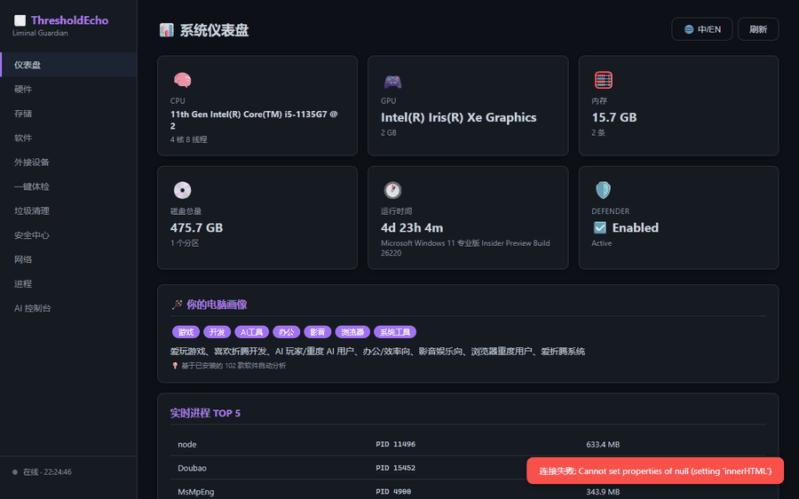

# ThresholdEcho 🌫️

> **轻量级 Windows AI 电脑管家 —— 不弹窗、不捆绑、不偷数据**

[](https://github.com)
[](https://www.python.org/)
[](#license)
[](https://github.com/YZHin/ThresholdEcho)

Windows 电脑管家千千万，但**会「思考」的不多**。ThresholdEcho 结合 OpenClaw AI 框架，不只是给你看数据，而是**替你读懂数据、解释问题、给出建议**——点一下进程名，AI 直接告诉你「这是什么、安不安全、能不能结束」。

✅ 开源免费（MIT）· ✅ 数据全本地 · ✅ 无弹窗无捆绑 · ✅ 轻量免安装（约 58MB 单文件）

---

## 🎬 功能演示



---

## ✨ 核心功能

| 模块 | 说明 |
|:--|:--|
| 🤖 **点击即问（v2.1 新）** | 点击任意进程/软件名，Echo 气泡即时解释：是什么、安全吗、能不能动 |
| 📊 **智能仪表盘** | CPU / 内存 / 硬盘 / GPU 实时概览，一眼看清系统状态 |
| 🏥 **一键体检** | 6 维度健康评分 + 问题分级（严重 / 建议 / 良好） |
| ✨ **一键修复** | 体检联动，自动清理临时文件 / 回收站 / 浏览器缓存 |
| 🧹 **垃圾清理** | 9 类垃圾扫描（临时文件 / 浏览器缓存 / Win 更新 / 日志等） |
| ⚙️ **进程管理** | 内存 TOP 15 + 结束进程（需确认） |
| 🛡️ **安全中心** | Defender 状态 / 防火墙 / 最近威胁 |
| 📦 **软件清单** | 已安装软件 + 启动项管理 |

## 🔗 与常用软件有机联动

| 联动对象 | 方式 |
|:--|:--|
| **OpenClaw Agent** | 对话操控电脑（体检 / 清垃圾 / 问空间），点击即问 AI 解释 |
| **Edge / Chrome / Firefox** | 浏览器缓存自动识别、分类统计、联动清理 |
| **Windows Defender** | 安全状态 / 防火墙 / 最近威胁实时联动 |
| **Windows 更新** | 更新缓存（SoftwareDistribution）扫描与清理 |

## ⚡ 为什么快？

AI 解释走 **DeepSeek API 直连**，点击后 **约 2 秒** 出结果（传统 Agent 方案要 20-30 秒）。

```
点击进程名 → Flask API → DeepSeek 直连（~2s）→ Echo 气泡解释
```

---

## 🚀 快速开始

### 方式一：下载 exe（推荐）

从 [Releases](https://github.com/YZHin/ThresholdEcho/releases) 下载 `ThresholdEcho.exe`，双击即用，无需安装环境。

### 方式二：源码运行

```powershell
# 桌面窗口（需 pywebview）
pip install pywebview
python desktop.py

# Web 控制台
python server.py
# 浏览器打开 http://127.0.0.1:5000
```

### 方式三：AI 对话操控（OpenClaw 集成）

把 `scripts/pc-manager/` 复制到 OpenClaw workspace 下，然后在聊天中直接指挥：

```
"体检"         → 跑扫描，显示健康评分
"清理垃圾"     → 预览 → 确认 → 执行
"C盘还有多少"  → 读缓存直接答
"这个进程是啥" → AI 解释进程
```

---

## 🛡️ 安全设计

- 🔒 所有网络通信仅绑定 `127.0.0.1`，外网不可达
- ✅ 破坏性操作（清理 / 结束进程）需用户确认
- 🚫 不收集用户数据，不连接任何远程服务器
- 🤖 AI 对话走本地 Gateway / 直连模型 API，数据不出本机

## 🏗️ 构建

```powershell
python -m PyInstaller ThresholdEcho.spec --noconfirm --clean
# 产物：dist/ThresholdEcho.exe
```

## 📂 项目结构

```
scripts/pc-manager/
├── scan.ps1              # PowerShell 扫描引擎
├── server.py             # Flask 后端（含 /api/agent/explain-*）
├── desktop.py            # 桌面窗口入口
├── canvas_dashboard.py   # Canvas 仪表盘生成器
├── templates/
│   └── index.html        # 前端面板（含 Echo 点击即问气泡）
└── dist/
    └── ThresholdEcho.exe # 构建产物
```

## 📝 License

[MIT](LICENSE)
